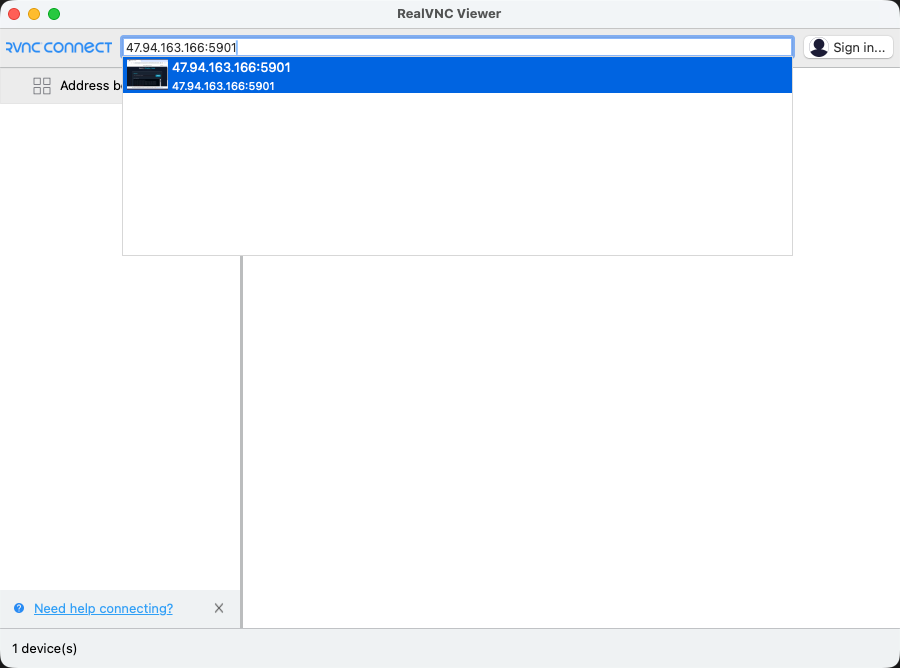
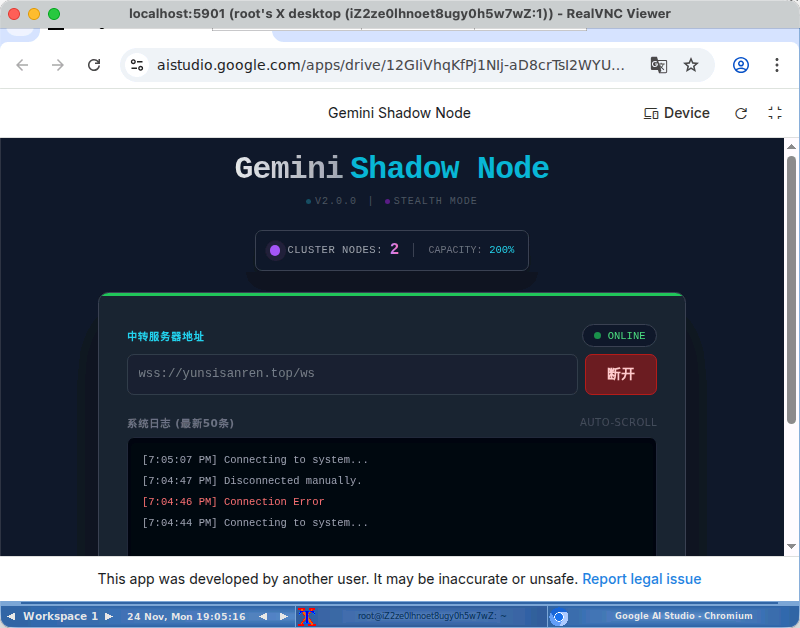
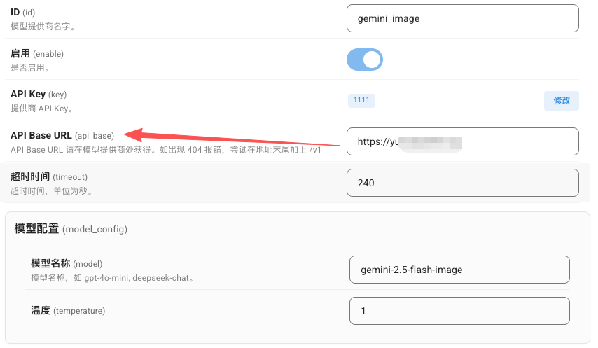

# 🚀 Gemini Shadow Node Applet 挂机指南 (图文版)

## 导语：我们必须保证Applet一直在AI STUDIO网页中运行，直接在家用电脑上挂机，显然不合适（毕竟家里断电、断网、关机都是常有的事）。所以我们选择用 VPS（就是你之前配置中转服务的那台）来挂机。

## 显然，如果兄弟们的服务器已经存在图形化桌面环境，那就不需要看这份教程了。直接在图形化桌面上打开一个浏览器，然后挂机即可。（为了防止浏览器自动杀死后台标签页，请参考 *第五步：保活操作*）

## 我的方案：Fluxbox + VNC + 内存优化版 Chromium

请严格按照以下步骤操作，不要多装任何一个不必要的软件包。

### 第一步：清理与安装极简环境

1. **更新源（老规矩）**：

   ```bash
   sudo apt update
   ```
2. **只安装最核心的组件**：

   * `fluxbox`: 极简窗口管理器（代替庞大的 XFCE/GNOME）。
   * `tightvncserver`: 远程桌面服务。
   * `chromium-browser`: 谷歌浏览器的开源版。
   * `xterm`: 一个最基本的终端（方便你在图形界面里敲命令）。

   ```bash
   sudo apt install fluxbox tightvncserver chromium-browser xterm -y
   ```

   *注意：如果系统提示安装大量的推荐包（Recommends），可以加上 `--no-install-recommends` 参数来节省空间，但上面的包通常依赖不多。*

### 第二步：配置 VNC 以启动 Fluxbox

1. **初始化密码**（如果之前没设过）：

   ```bash
   vncserver
   # 设置密码，View-only 选 n
   vncserver -kill :1
   ```
2. **编写极其节省内存的启动脚本**：
   备份旧配置：

   ```bash
   mv ~/.vnc/xstartup ~/.vnc/xstartup.bak 2>/dev/null
   nano ~/.vnc/xstartup
   ```

   **粘贴以下内容**（这是核心，告诉 VNC 只启动 Fluxbox，不加载花里胡哨的背景图、工具栏等）：

   ```bash
   #!/bin/sh
   unset SESSION_MANAGER
   unset DBUS_SESSION_BUS_ADDRESS

   # 【关键】先启动一个终端，加 & 符号让它在后台运行
   xterm -geometry 80x24+10+10 -ls -title "Terminal" &

   # 最后启动窗口管理器
   exec /usr/bin/fluxbox
   ```

   赋予权限：

   ```bash
   chmod +x ~/.vnc/xstartup
   ```

   

### 第三步：启动 VNC 服务

为了省资源，我们甚至不需要高分辨率。`800x600` 就足够你操作了。

```bash
vncserver -geometry 800x600 -depth 16 :1
```

* `-depth 16`：使用 16位色深，比 24/32位 更省显存和带宽。
  

### 第四步：连接并启动“魔改参数”的浏览器

0. **在本地电脑上安装并打开 VNC Viewer，[下载地址](https://www.realvnc.com/en/connect/download/viewer/)**。
1. ~~**使用 VNC Viewer 直接连接**到 `你的IP:5901` (需在服务器后台管理页面开放5901端口, **极度不推荐**)。~~
   

#### 使用SSH 隧道（强烈推荐！）：

1. **在你的 本地电脑 终端（Terminal）里**，运行这条命令来建立隧道：*(把 `47.94.163.166` 换成你真实的 IP)*

```bash
ssh -L 5901:127.0.0.1:5901 root@47.94.163.166
```

*解释：这句话的意思是“把我本地电脑的 5901 端口，通过 SSH 隧道，映射到服务器的 127.0.0.1:5901”。*
2.  **登录服务器**：
命令回车后，输入服务器密码登录 SSH。保持这个终端窗口**不要关闭**（最小化即可）。
3.  **修改 VNC Viewer 的连接地址**：
打开你的 RealVNC Viewer，新建一个连接（或者修改旧的）：

* **不要**再填 `47.94.163.166:5901` 了。
* **改成**：`localhost:5901`
  

这时，你应该可以看到 VPS 上的图形化桌面和xterm终端了：


**关键点来了**：使用以下命令启动chromium (复制后使用鼠标中键粘贴到VNC的xterm终端)：

```bash
chromium-browser \
  --no-sandbox \
  --disable-gpu \
  --disable-dev-shm-usage \
  --renderer-process-limit=2 \
  --window-size=800,550 \
  --proxy-server="http://127.0.0.1:20171" \
https://aistudio.google.com/apps/drive/12GIiVhqKfPj1NIj-aD8crTsI2WYUmuER?fullscreenApplet=true
```

**参数详解（必看）**：

* `--no-sandbox`：root 用户运行必需。
* `--disable-gpu`：VPS 没有显卡，关掉它省资源。
* `--disable-dev-shm-usage`：**极重要**。防止 `/dev/shm`（共享内存，通常较小）爆满导致浏览器崩溃，强制它使用 `/tmp`（硬盘空间）。
* `--renderer-process-limit=2`：**核心优化**。限制渲染进程的数量。默认情况下 Chrome 每个标签页一个进程，这会吃光你的 2G 内存。限制为 2 可以强迫多个标签页共用进程，极大地节省内存。
* `--proxy-server="http://127.0.0.1:20171"`: 设置魔法工具地址，比如V2rayA默认端口20171（请根据你自己使用的魔法工具端口修改）。若您的VPS可以直连Google，则去掉此参数。

#### 若出现报错 `Client is not authorized to connect to Server`


请先运行以下命令再使用上面命令启动浏览器：

```bash
apt install x11-xserver-utils -y
xhost +
```

#### 若一切顺利，请登陆您的Google AI Studio账号，并填写您配置的中转服务地址，启动Applet。



#### 注意：您可以同时打开多个标签页，并登陆不同的账号运行Applet。这样您将获得更多的免费使用额度和更稳定的体验！（我们的中转服务会自动调度选择最佳线路，并且使用故障转移技术保证用户体验）

### 第五步：保活操作 (最后一道防线)

1. **防杀后台设置**：

   * 在浏览器地址栏输入：`chrome://discards/`
   * 找到 AI Studio 的标签页。
   * 在 **"Auto Discardable"** 这一列，点击 `Toggle` 把它变成 `✘` (叉号)。
   * **解释**：Chrome 自己有个“贱”机制，觉得内存不够就会主动杀掉后台标签页。这个设置是告诉 Chrome：“**哪怕卡死，也不要杀掉这个页面！**”
     
2. **关闭 VNC 客户端**。

   * 你可以放心地关掉你本地的 VNC Viewer。VPS 里的 Fluxbox 和 Chromium 依然在坚强地运行。

### 第六步：定期检查与维护

建议每隔几天通过 VNC 连接检查一下 Chromium 是否还在运行，Applet 是否正常工作。如果发现问题，可以重启 VNC 服务和 Chromium。

## 🎉 恭喜！
现在您可以在任何支持Gemini格式的客户端处使用免费Gemini了！仅需替换API BaseURl为您的中转服务地址，如`https://xxxx-xxxx.ngrok-free.dev` 或 `https://your-site`。

> **注：某些客户端需要形如 `https://your-site/v1beta` 或 `https://your-site/v1` 的地址，请根据实际情况添加路径。**



## 💡 小内存机子的锦囊 (Troubleshooting)

* **关于内存**：2G 内存的 VPS，建议配置 4G 或更大的 Swap 分区/文件。Swap 越大越好，至少要比物理内存大一倍（比如 2G 内存，建议 4G 以上 Swap）。

  ```bash
  # 创建一个 4G 的 Swap 文件（如果你已经有 Swap，可以跳过）
  sudo fallocate -l 4G /swapfile
  sudo chmod 600 /swapfile
  sudo mkswap /swapfile
  sudo swapon /swapfile
  # 永久启用，在 /etc/fstab 添加一行
  echo '/swapfile none swap sw 0 0' | sudo tee -a /etc/fstab
  ```
* **关于 Swap**：如果发现系统卡顿严重，可以调整 `swappiness`。

  ```bash
  # 查看当前值（通常是60）
  cat /proc/sys/vm/swappiness
  # 建议调高到 80 至 100，告诉内核：积极使用 Swap，把物理内存留给活跃的 Chrome 进程。
  sudo sysctl vm.swappiness=80
  ```
* **关于 ZSwap**：如果 VPS 支持，可以启用 ZSwap 压缩交换缓存，提升 Swap 性能。

  ```bash
  # 启用 ZSwap
  echo 1 | sudo tee /sys/module/zswap/parameters/enabled
  ```
* **关于 Zram**：如果 VPS 资源允许，可以考虑启用 Zram 压缩内存块，提升整体内存利用率。

  ```bash
  sudo apt install zram-tools
  sudo systemctl enable --now zramswap.service
  ```
  配置文件在 `/etc/default/zramswap`，可以调整压缩内存大小。
* **如果崩溃**：如果 Chromium 还是崩了，检查 `dmesg` 命令的输出。如果是 `OOM-killer` 杀掉的，说明 Swap 还是不够快或者不够大。
