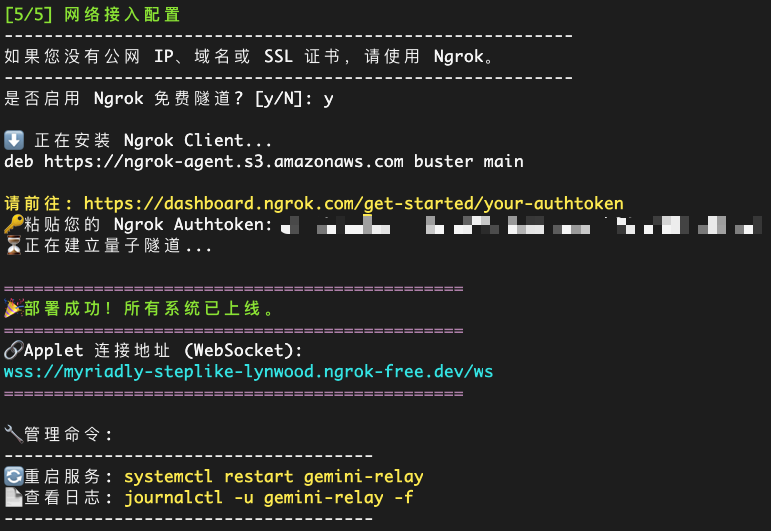

# 🚀 Gemini 中转服务器 (Relay Server) 一键部署指南 (图文版)

这个文件包含了使用 Node.js、Express 和 `ws` 库实现中转服务器的完整代码。

## 核心功能

- **通用 HTTP 代理**: 暴露 `/v1beta/*` 通配符端点。它捕获任何 Gemini API 请求（包括模型名称、生成配置、系统指令等）并按原样转发。
- **WebSocket 服务器**: 在 `/ws` 路径上启动一个 WebSocket 服务器，等待安全的 Applet 客户端连接。
- **透明转发**: 将 HTTP 请求的 **路径 (Path)** 和 **请求体 (Body)** 打包并通过 WebSocket 发送给 Applet。
- **响应匹配**: 使用唯一的请求 ID 来匹配从 Applet 返回的响应，并将其作为 HTTP 响应发送回给原始请求者。

---

## 📋 准备工作

1. 你需要一台国内可以正常访问的 **Linux 服务器** (推荐 Ubuntu/Debian)。
2. 你需要 **Root 权限** (或者使用 `sudo`)。
3. 你的服务器可以**正常访问谷歌AI STUDIO服务**。

---

## 第一步：一键部署

1. 执行一键部署脚本（复制下面命令到服务器终端执行）：

   ### 方案 A：通用标准版 (推荐)

   适用于所有可以正常访问 GitHub 的网络环境（如海外 VPS）。


   ```bash
   bash <(curl -fsSL https://raw.githubusercontent.com/TianLanDaoRen/GeminiShadowNode/main/doc/relay-server-installer.sh)
   ```

   ### 方案 B：国内加速版 (中国大陆优化)

   由于 GitHub 的 Raw 域名在国内经常被 DNS 污染或阻断，建议加上公益加速代理（如 `ghproxy`），确保国内机器也能秒下载。

   ```bash
   bash <(curl -fsSL https://ghproxy.net/https://raw.githubusercontent.com/TianLanDaoRen/GeminiShadowNode/main/doc/relay-server-installer.sh)
   ```
2. 按照提示继续，输入中转服务使用的**端口号**（默认 3000）：
   
3. 可选是否安装Ngrok（也可以手动配置Nginx或者任何您常用的网络服务，见下文）：
   
4. 按脚本指引打开网页，登陆Ngrok账号，获得认证令牌（**不使用Ngrok可跳过**）：
   
5. 完成！请记录Applet连接地址（Ngrok自动生成）
   
   > **注**: Applet连接地址为 `wss://xxxx-xxxx.ngrok-free.dev/ws` 格式（如果使用Ngrok）  
   > API请求地址为 `https://xxxx-xxxx.ngrok-free.dev/` 格式。

---

## 第二步（若使用Ngrok请跳过）：配置 Nginx (HTTPS 与 大文件支持)

如果不配置 Nginx，你只能用 `http://IP:3000`，这不安全且 Applet 无法连接（因为 Applet 在 HTTPS 环境下必须连 WSS）。

1. **编辑你的 Nginx 站点配置** (假设你的域名已配置好 SSL)：

   ```bash
   sudo nano /etc/nginx/sites-available/your-site # 替换为你的站点配置文件
   ```
2. **确保包含以下核心配置** (特别是 WebSocket 支持和大小限制)：

```nginx
server {
    listen 443 ssl;
    server_name your-site; # 替换为你的域名

    # ... SSL 证书配置 ...

    # 【关键 1】允许上传大文件 (如视频/图片)
    client_max_body_size 512m;

    # 1. 转发 WebSocket (/ws)
    location /ws {
        proxy_pass http://127.0.0.1:3000;
  
        # WebSocket 协议升级头 (必须!)
        proxy_http_version 1.1;
        proxy_set_header Upgrade $http_upgrade;
        proxy_set_header Connection "upgrade";
  
        # 传递真实 IP
        proxy_set_header Host $host;
        proxy_set_header X-Real-IP $remote_addr;
        proxy_set_header X-Forwarded-For $proxy_add_x_forwarded_for;

        # 超时设置 (防止生成视频时长连接断开)
        proxy_read_timeout 300s;
        proxy_send_timeout 300s;
    }

    # 2. 转发 API 请求 (/v1beta)
    location /v1beta/ {
        proxy_pass http://127.0.0.1:3000;
  
        proxy_set_header Host $host;
        proxy_set_header X-Real-IP $remote_addr;
        proxy_set_header X-Forwarded-For $proxy_add_x_forwarded_for;

        # 同样需要长超时
        proxy_read_timeout 300s;
    }
  
    # ... 其他配置 ...
}
```

3. **测试并重载 Nginx**：
   ```bash
   sudo nginx -t
   sudo systemctl reload nginx
   ```

---

## 📝 常用维护命令

现在，你的服务器已经完全自动化了。以下是一些常用命令：

* **查看实时日志** (查看 Applet 连接状态、报错等)：

  ```bash
  journalctl -u gemini-relay -f
  ```

  *(按 `Ctrl+C` 退出)*
* **重启服务** (如果你修改了 `index.js` 代码)：

  ```bash
  sudo systemctl restart gemini-relay
  ```
* **停止服务**：

  ```bash
  sudo systemctl stop gemini-relay
  ```

---

## 🎉 部署完成

现在，你的中转服务器已经：

1. **支持 512MB 大数据包**（视频/高清图无压力）。
2. **智能防断连**（生成任务时不会因心跳超时被杀）。
3. **全自动运行**（VPS 重启后自动复活）。
4. **安全加密**（通过 Nginx 走 HTTPS/WSS）。

现在去你的 Applet 里填入 `wss://your-site/ws` （或`wss://xxxx-xxxx.ngrok-free.app/ws` [使用Ngrok]），即可享受丝滑的 Gemini 服务！

这里为您准备了一份语气亲切、技术点透彻的说明文案，适合直接发布在 GitHub `README.md`、项目文档或者社区公告中。

---

# <a id="qa">💡 选 Ngrok 还是自己配 Nginx？兄弟们该怎么选？</a>

咱们的一键部署脚本提供了 **Ngrok 自动集成** 和 **本地端口模式** 两种选择。  
很多兄弟可能纠结选哪个，这里给大家做一个最直白的对比分析，帮你避坑。

## ⚡ 太长不看版


| 你的情况                         | 推荐方案                   | 理由                                                         |
| :------------------------------- | :------------------------- | :----------------------------------------------------------- |
| **纯小白 / 没域名 / 懒得折腾**   | **✅ 脚本自带的 Ngrok**    | 傻瓜式一键启动，不用买域名，不用搞证书，马上能用。           |
| **有云服务器 / 有域名 / 追求稳** | **🛠 自己配 Nginx**        | 地址固定，速度最快，完全掌控，适合长期稳定运行。             |
| **家里软路由 / 无公网 IP**       | **☁️ Cloudflare Tunnel** | (脚本选"否")，自行配置 CF Tunnel，穿透最稳，且免费固定域名。 |

---

## 方案一：使用脚本自带的 Ngrok (适合尝鲜/测试)

如果你在运行脚本时，在 "是否启用 Ngrok" 选项填了 `y`，脚本会自动帮你申请隧道。

* **优点**：
  * 🚀 **极速上手**：你不需要懂任何网络知识，不需要买域名，不需要申请 SSL 证书。
  * 🔒 **自动 HTTPS**：Ngrok 自动给你一个安全的 `wss://` 地址。
  * 🌍 **无视内网**：就算你的服务器在家里（没有公网 IP），外网也能连进来。
* **缺点**：
  * ⚠️ **地址会变**：Ngrok 免费版每次重启服务（或网络波动重连），**网址都会变**！这意味着你得经常去 Applet 里改地址。
  * 🐌 **速度限制**：免费版有速率限制，传输大视频可能会慢。
  * ⏱ **连接数限制**：并发连接数有限，不适合很多人共用一个节点。

---

## 方案二：自己配置 Nginx / 反向代理 (适合生产环境)

如果你在运行脚本时，在 "是否启用 Ngrok" 选项填了 `n`，脚本只会监听本地端口（默认 `3000`）。这时候你需要自己把这个端口暴露给外网。

* **优点**：
  * 🏰 **永久固定**：你可以绑定自己的域名（如 `api.yoursite.com`），地址永远不变。
  * ⚡️ **满速运行**：直接走服务器带宽，没有任何中间商赚差价。
  * 🛡 **安全可控**：你可以配置 IP 白名单、WAF 防火墙等。
* **缺点**：
  * 🤯 **门槛高**：你需要会写 Nginx 配置，需要自己申请 SSL 证书（Let's Encrypt），需要去云厂商后台放行安全组端口。

---

## 📢 建议

1. **刚开始玩**：直接用脚本的 Ngrok，先把流程跑通，看到效果最重要。
2. **觉得好用想长期挂**：建议花几十块钱买个便宜域名，配上 Nginx，这才是长久之计。
3. **Applet 填地址格式**：
   * Ngrok: `wss://xxxx-xxxx.ngrok-free.dev/ws`
   * Nginx: `wss://你的域名/ws`

祝兄弟们部署顺利！🚀
